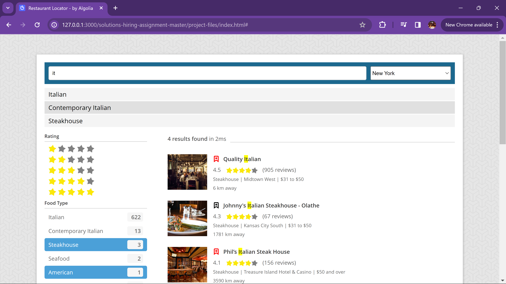

# Restaurant Finder - Algolia Search Demo

## Introduction

This project is a prototype designed to highlight the benefits of an enhanced search experience for a large restaurant reservation website. As per the assignment guidelines, this prototype integrates Algolia's search capabilities with a custom UI to deliver an intuitive and efficient as-you-type search experience.

Below is a screenshot of our application's main interface, which illustrates how users can easily navigate through the various features:


## Project Setup

This project is published on GitHub Pages to allow for easy interaction and evaluation: [Visit Live Demo](https://jonx.github.io/algolia/)

## Technical Implementation

#### Data Merging Script

The dataset provided was in two separate files: `restaurants_list.json` and `restaurants_info.csv`. A Python script was developed to merge these files based on the restaurant IDs, ensuring that each entry in the final dataset includes the type of cuisine. This merged dataset was then pushed to an Algolia index for searching.

The script performs the following actions:
- **Data Loading**: Loads JSON and CSV files into pandas DataFrames.
- **Data Merging**: Merges the two DataFrames on the 'objectID' key.
- **Data Cleaning**: Replaces specific payment options to conform to required values.
- **Data Saving**: Saves the cleaned and merged data back into a JSON file for further use.

The script is detailed below:

```python
import pandas as pd
import json

print("Merging in progress...")

# Load the JSON data
with open('./restaurants_list.json', encoding='utf-8') as file:
    restaurants_list = json.load(file)

# Load the CSV data
restaurants_info = pd.read_csv('./restaurants_info.csv', delimiter=';', encoding='utf-8')

# Convert JSON data to DataFrame
restaurants_list_df = pd.DataFrame(restaurants_list)

# Merge DataFrames on 'objectID'
merged_data = restaurants_list_df.merge(restaurants_info, on='objectID', how='left')

# Allowed payment options
allowed_payment_options = ["AMEX", "American Express", "Visa", "Discover", "MasterCard"]

# Replace "Diners Club" and "Carte Blanche" with "Discover" and filter allowed payment options
def clean_payment_options(payment_options):
    mapping = {"Diners Club": "Discover", "Carte Blanche": "Discover"}
    return sorted(set([mapping.get(option, option) for option in payment_options if option in allowed_payment_options]))

# Collect all unique payment options before cleaning
all_payment_options = set([option for sublist in restaurants_list_df['payment_options'] for option in sublist])

# Apply the cleaning function to the 'payment_options' column
merged_data['payment_options'] = merged_data['payment_options'].apply(clean_payment_options)

# Calculate discarded payment options
discarded_payment_options = all_payment_options.difference(set(allowed_payment_options)).difference({"Diners Club", "Carte Blanche"})

# Convert merged data back to a list of dictionaries (JSON format)
merged_json_data = merged_data.to_dict(orient='records')

# Save the merged data to a JSON file
merged_json_path = 'merged_restaurants.json'

with open(merged_json_path, 'w', encoding='utf-8') as file:
    json.dump(merged_json_data, file, indent=4)

print("Merged dataset successfully saved to:", merged_json_path)
print("Discarded payment options:", discarded_payment_options)
```

#### Image and State Update Script

Given that some restaurant images were outdated, a second script was developed to scrape updated images and restaurant state (open or closed) from provided URLs. It replaces missing or outdated images with current ones and updates the operational state of each restaurant.

This script does the following:
- Fetches each restaurant's web page from its URL.
- Scrapes the updated image URL and checks the operational state.
- Updates the restaurant's data with new images and current open/closed status.

```python
import json
import logging
import re
from urllib.request import urlopen

# Setup basic configuration for logging
logging.basicConfig(level=logging.INFO, format='%(asctime)s - %(levelname)s - %(message)s')

restaurants_list_path = 'merged_restaurants.json'
output_path = 'updated_restaurants_with_images.json'

logging.info("Starting the image update process...")

def fetch_new_image_url(page_content):
    # Regular expression to find image URLs ending with .webp or .jpg
    image_url_pattern = re.compile(r'https://resizer\.otstatic\.com/v2/photos/[^.]+?\.(webp|jpg|jpeg)')
    match = image_url_pattern.search(page_content)
    if match:
        # Return the matched URL with its original extension
        return match.group()
    return "https://cdn.otstatic.com/legacy-cw/default2-original.png"

# def fetch_new_image_url(page_content):
#     # We're not handling the edge case where the image has an image external to opentable like this one:
#     # https://www.opentable.com/ichabods-lounge?restId=111058
#     # 
#     start_marker = 'https://resizer.otstatic.com/v2/photos/wide-huge/'
#     start_index = page_content.find(start_marker)
#     if start_index != -1:
#         end_index = page_content.find('.webp', start_index)
#         if end_index != -1:
#             return page_content[start_index:end_index] + '.jpeg'
#     return "https://cdn.otstatic.com/legacy-cw/default2-original.png"

def check_restaurant_state(page_content):
    if "permanently closed" in page_content.lower():
        return "closed"
    return "open"

def update_image_urls_and_state(restaurants):
    default_image_url = "https://cdn.otstatic.com/legacy-cw/default2-original.png"
    default_state = "unknown"

    for restaurant in restaurants:
        try:
            response = urlopen(restaurant['mobile_reserve_url'])
            page_content = response.read().decode('utf-8')
            restaurant['image_url_new'] = fetch_new_image_url(page_content) or default_image_url
            restaurant['state'] = check_restaurant_state(page_content)
        except Exception as e:
            logging.error(f"Error during request to {restaurant['mobile_reserve_url']}: {e}")
            # Set default values in case of an error
            restaurant['image_url_new'] = default_image_url
            restaurant['state'] = default_state
        finally:
            logging.info(f"ID: {restaurant['objectID']}, state: {restaurant['state']}, New Image URL: {restaurant['image_url_new']}")


try:
    with open(restaurants_list_path, 'r', encoding='utf-8') as file:
        restaurants = json.load(file)
    
    update_image_urls_and_state(restaurants)

    with open(output_path, 'w', encoding='utf-8') as file:
        json.dump(restaurants, file, indent=4)

    logging.info(f"Updated restaurant data with images and state saved to: {output_path}")

except Exception as e:
    logging.error(f"Error processing restaurant images and state: {e}")
```

Both scripts are integral to preparing the data for a seamless search experience, ensuring that the information is both current and relevant.

## Features Implemented

- **Geolocation-Based Search**: Prioritizes restaurants based on the user's proximity, enhancing the relevance of search results. The default choice is to not use any user location, but the user can decide to use his own location with a fallback to using his IP address. For testing purposes you can also select to be located in several cities in the US given it's not very useful to be located 6000 km away from the restaurants in the dataset.
- **Advanced Filtering**: Allows users to filter restaurants by type of cuisine, leveraging Algolia's faceting capabilities. Both "AND" facets e.g. "Food Type", "City", etc. and "OR" facets e.g. "Open" are implemented. By default only open restaurants are listed. Restaurants in "Unknown" state do not exist anymore but have been kept for reference (you might have liked a restaurant that is closed and want it to influence your search results). An example of star rating filter is also implemented. Aray facets like payment where you can select more than one payment method is also supported.
- **As-You-Type Search**: Implements Algolia's JS Helper to deliver real-time search results as the user types their query.
- **Custom UI Enhancements**: Adopts a UI closely aligned with the provided mock-ups but optimized for usability and aesthetics.

## Additional Features Implemented

- **Suggestions**: Autocomplete suggestions improve search efficiency using query suggestions. Note that the implementation is storing a user id and those suggestions are specific to a user, so you might not get suggestions right away during testing, but the feature is implemented.
- **Highlight Result**: Autocomplete suggestions improve search efficiency.
- **Liked Restaurants**: Users can like restaurants (likes are not visually persisted), and these preferences are tracked using events for potential personalization.

## Server-Side Features

- **Synonyms**: Synonym handling ensures that searches are flexible and understand similar culinary terms.
- **Events**: Tracks user interactions for analytics purposes.

## Notes

- This code is just an example and is obviously not ready for production.
- JQuery was used in order to make the JS less verbose comparing to using Vanilla JS.
- This code has not been optimized for mobile viewing and is also not responsive.

## Conclusion

This project not only adheres to the specified requirements but also introduces additional functionalities that enhance the overall user experience. It showcases the powerful capabilities of Algolia's search API combined with robust front-end development.

